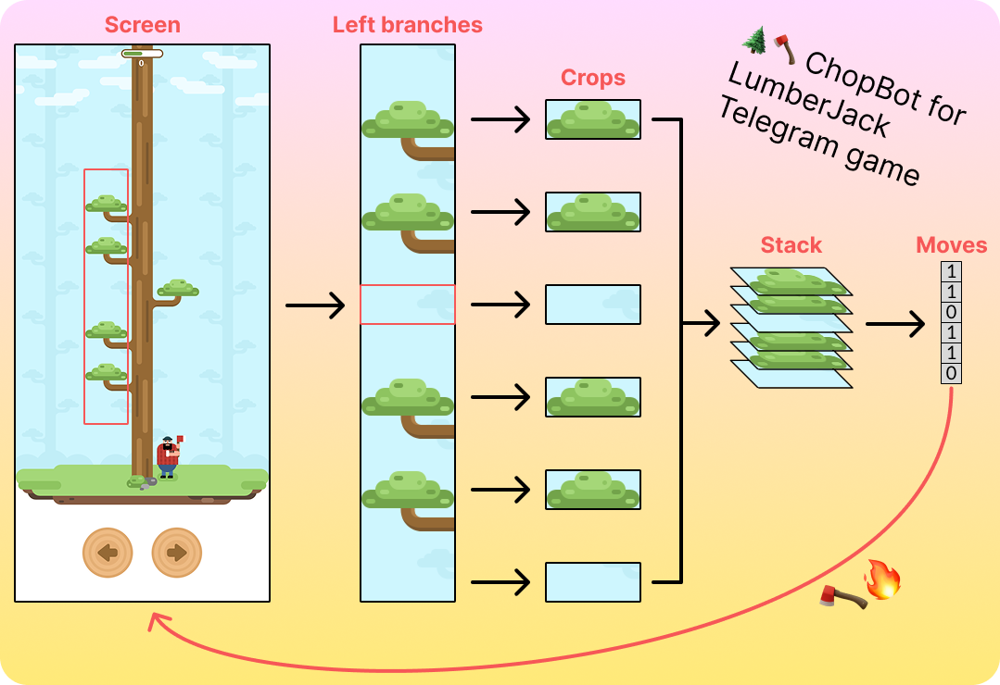

# 🌲🪓 ChopBot for LumberJack Telegram game (best score 1140🔥)

Ready to crush your friends at **LumberJack on Telegram** with a 1000+ score? Configure your capture region, hit Space, and let ChopBot do the rest!
Soon the leaderboard will be like this:
- 🥇 ChopBot – 1140 chops
- 🥈 Your Best Friend – 247 chops
- 🥉 Your Best Friend #2 – 130 chops

ChopBot captures the game screen, computes the optimal moves in batches, and performs key presses at high speed.
He is so committed to the game that will keep chopping even when the game is over unless you stop it...
Needless to say, Chopbot only fears screen lag and slow CPUs. Otherwise: He Came 👨🏼‍💻. He Saw 🖥️. He Chopped 🪓.



## 🕹️ About the Game

**LumberJack** is a fast-paced Telegram mini-game where players chop a virtual tree by selecting left or right to avoid branches and score as many chops as possible, testing their reflexes.
Play it yourself here: [https://tbot.xyz/lumber/](https://tbot.xyz/lumber/)

## 🔧 Setup

1. **Clone the repo**:
   ```bash
   git clone https://github.com/massimilianoviola/chopbot-lumberjack.git
   cd chopbot-lumberjack
   ```
2. **Create & activate a Python environment**:
   ```bash
   conda create -n chopbot python==3.13 -y
   conda activate chopbot
   ```
3. **Install dependencies**:
   ```bash
   pip install -r requirements.txt
   ```

## ⚙️ Configuration

1. **Open** `config.ini` and adjust the `[region]` values to match the interesting region in your screen:
   ```ini
   [region]
   top = 417            # Y-offset of capture box
   left = 1145          # X-offset of capture box
   width = 100          # Width of capture box
   height = 600         # Height of capture box
   monitor_number = 0   # Monitor index for multi-monitor setups
   ```
2. **Optional**: tweak delays under `[bot]` so that your PC can keep up and not make mistakes:
   ```ini
   [bot]
   key_delay = 0.008            # Seconds between key taps
   screenshot_delay = 0.1165    # Seconds between screen captures
   ```

> **⚠️ Warning:** Getting your region offsets right is critical. Your region should include all 6 branches in a 600×100 window, where each branch starts at the bottom of its 100×100 segment (see [here](assets/screen-20250421-220705-529.png)). Use the debug mode (`[debug] enabled = true`) to dump screenshots and fine-tune the box.

## 🪓 Usage

Run ChopBot from the command line:

```bash
python chopbot.py
```

- **Space**: start the bot after the initial countdown
- **Esc**: stop the bot at any time

| 🏆 Best Scores | 🎥 Gameplay Video |
| -------------- | ------------------ |
| [Best Scores Screenshot (1140)](assets/best_score.png) | [Watch ChopBot take down those trees](assets/gameplay.mp4) |

## 🧩 Architecture

1. **IOProvider** (`io_provider.py`)
   - Grabs a configured screen region via MSS
   - Extracts only the green channel (2D array) for maximum speed
   - Simulates key presses via Pynput

2. **Move Calculator** (`moves.py`)
   - Splits the screen into 6 horizontal bands
   - Analyze the bottom rows of each band for branch presence
   - Outputs a list of `['left' | 'right']` moves based on the analysis

3. **ChopBot Agent** (`chopbot.py`)
   - Waits for Space or timeout to start
   - Runs the main loop: capture → compute → act
   - Listens for Esc to terminate
